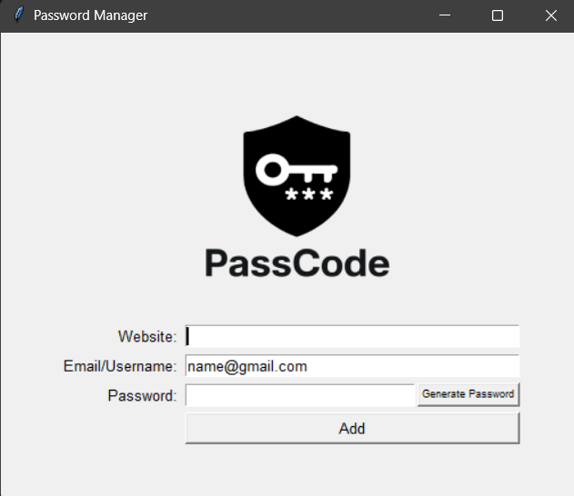

# 🔒 Password Manager

A simple and effective **password manager** built using Python’s `tkinter` module. This application allows you to generate secure passwords and save them alongside associated websites and emails.

---

## ✨ Features

✅ **Password Generator**  
- Generates a random, secure password with a mix of letters, symbols, and numbers.  
- Easy one-click generation.

✅ **Save Credentials**  
- Save website, email, and password combinations to a `data.txt` file.  
- Prompts user for confirmation before saving.

✅ **User-Friendly Interface**  
- Clean and simple `tkinter` GUI.  
- Convenient entry fields and buttons.

---

## 🖼️ User Interface



---

## 📁 File Structure

```
password-manager/
├── logo.png          # Logo image used in the UI
├── data.txt          # File to store saved credentials
└── main.py           # Main Python script with GUI and logic
```

---

## ▶️ How to Run

1. Ensure you have Python 3 installed.
2. Place all files (`main.py`, `logo.png`) in the same directory.
3. Open a terminal and run:
   ```bash
   python main.py
   ```
4. The app window will appear. Enter your details and start managing your passwords!

---

## ⚙️ Customization

🔧 **Change The Default Email**  
Change the default email of `email@gmail.com` to your desired email to save typing.
```python
YOUREMAIL = 'email@gmail.com'
```

🔧 **Adjust Password Complexity**  
In `generate_password()`:
```python
nr_letters = 8   # Number of letters in generated password
nr_symbols = 2   # Number of symbols
nr_numbers = 2   # Number of numbers
```

🔧 **Modify UI Layout & Font**  
Update the `FONT` and `BUTTON_FONT` variables for different looks:
```python
FONT = ("Arial", 10)
BUTTON_FONT = ("Arial", 7)
```

🔧 **Change Saved File**  
Change `"data.txt"` in the `save()` function to another filename if desired.

---

## 📦 Requirements

- Python 3.x  
- `tkinter` (comes with Python)  

---

## ⚠️ Notes & Tips

- The passwords and details are stored in plain text (`data.txt`). For enhanced security, consider **encrypting the file** or using a more robust storage solution.  
- Always backup your data!

---

## 📄 License

This project is open-source and available under the [MIT License](LICENSE).

---

## 🙌 Acknowledgments

A simple but powerful project to **practice GUI development** and **basic file handling** in Python. Perfect for beginners to level up their Python skills!

---
